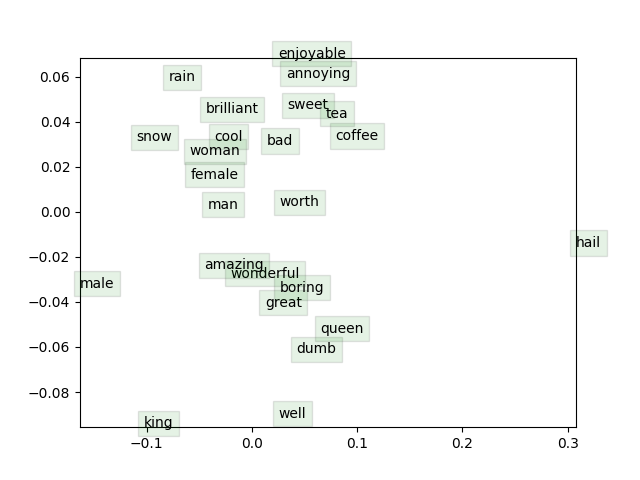

## Question 1

_a_. Prove that the naive-softmax loss (Equation 2) is the same as the cross-entropy loss between $y$ and $\hat{y}$, i.e. (note that $y, \hat{y}$ are vectors and $\hat{y_{o}}$ is a scalar):

$$-\sum _{u\in Vocab}y_{w}\log \left( \widehat{y}_{w}\right) =-\log \left( \widehat{y}_{0}\right) $$

Your answer should be one line. You may describe your answer in words.

**Answer:**

We are calculating loss function for one input which is $P(o|c)$ one outer word with respect to center word. The cross entropy loss function is the lefthand side, that is the summation of all word loss probabilities.

In the center equation, splitting the input outer word & all other words with respect to center word.

Now, the expected probability of input outer word is $1$. Then for other words the probability is $0$.

So $\hat{y_{0}} = 1,\hat{y_{w}} = 0$

So we get the righthand side equation.

---

**b(i)**. Compute the partial derivative of $J_{naive-softmax}(v_c,o,U)$ with respect to $v_c$ Please write your answer in terms of $y, \hat{y},U$, and show your work to receive full credit.

- **Note** Your final answers for the partial derivative should follow the shape convention: the partial derivative of any function $f(x)$ with respect to $x$ should have the same shape as $x^{4}$
- Please provide your answers for the partial derivative in vectorized form. For example, when we ask you to write your answers in terms of $y, \hat{y},U$, you may not refer to specific elements of these terms in your final answer (such as $y_{1}, y_{2}, \dots$ ).

**Answer:**

$$\dfrac{\partial J\left( \theta \right) }{\partial Vc}=\dfrac{-\partial }{\partial V_{c}} \left( \log p \left(  o| c\right) \right)$$
$$-\frac{\partial}{\partial V_{c}}(\log P(v_{o}|v_{c}))$$
$$-\frac{\partial}{\partial v_{c}}\log \frac{\exp(u_{0}^{T}v_{c})}{\Sigma_{w \in V} \exp(u_{w}^{T}v_{c})}$$
$$-\frac{\partial}{\partial v_{c}}\left( \log \exp (u_{o}^{T}v_{c}) - \log \Sigma_{w \in v} \exp (u_{w}^{T} v_{c})\right)$$
$$- \frac{\partial}{\partial v_{c}}\log \exp (u_{o}^{T}v_{c}) + \frac{\partial}{\partial v_{c}} \log \Sigma_{w \in v} \exp (u_{w}^{T}v_{c}) $$
$$\frac{\partial}{\partial v*{c}}\log \Sigma*{w \in V} \exp (u*{w}^{T}v*{c})$$
$$\frac{1}{\Sigma*{w \in v} \exp(u*{w}^{T}v*{c})} \Sigma*{x \in v} \exp(u*{x }^{T}v*{c})$$
$$\frac{1}{\Sigma*{w \in v} \exp(u*{w}^{T}v*{c})} \cdot \Sigma*{x \in v}\exp(u*{x}^{T}v*{c}) \cdot \frac{\partial}{\partial v*{c}}(u*{x}^{T}v*{c})$$
$$\frac{1}{\Sigma*{w \in v} \exp(u*{w}^{T}v*{c})} \cdot \Sigma*{w \in v} \exp(u*{x}^{T}v*{c})\cdot u*{x}^{T}$$
$$\frac{\Sigma*{x \in v} \exp(u*{x}^{T}v*{c})}{\Sigma*{w \in v} \exp(u*{w}^{T}v*{c}} \cdot u*{x}^{T}$$
$$\Sigma*{x \in v} \frac{\exp(u*{x}^{T}v*{c})}{\Sigma*{x\in v} \exp(u*{w}^{T}v*{c})} \cdot u*{x}^T$$
$$\Sigma*{x \in v}P(x|c) \cdot u*{x}^T$$
$$\frac{\partial J(\theta)}{\partial v*{c}} = -u*{o}+\Sigma*{w \in v}P(w|c)\cdot u*{w}$$
$$=U(\hat{y}-y)$$

---

**b.ii.** When is the gradient you computed equal to zero?
Hint: You may wish to review and use some introductory linear algebra concepts.
**Answer:**

$$
p\left(  w| c\right) =\begin{cases}1,w=0\\
0,otherwise\end{cases}
$$

---

**b(iii).** The gradient you found is the difference between two terms. Provide an interpretation of how each of these terms improves the word vector when this gradient is subtracted from the word vector $v_{c}$.
**Answer:**
$$U(\hat{y}-y)$$
where:

- $\hat{y}$ - Predicted value
- $y$ - Actual value
  In the gradient we are getting output as predicted value - actual value. When we subtract the vector with the outer word vector. The gradient shifts the vector in a small step closer to the actual output value. Over iterations we get the best value.

---

**b(iv)** In many downstream applications using word embeddings, $L2$ normalized vectors (e.g. $u/||u||2$
where $||u||2 = \sqrt{ \Sigma_{i} u_{i}^2 }$ ) are used instead of their raw forms (e.g. $u$). Now, suppose you would
like to classify phrases as being positive or negative. When would $L2$ normalization take away
useful information for the downstream task? When would it not? Hint: Consider the case where
$u_{x} = \alpha u_{y}$ for some words $x \neq y$ and some scalar $\alpha$
**Answer:**
$$||u||2 = \sqrt{ \Sigma_{i} u_{i}^2 }$$
where $u_{i}^{2}= u_{i}^T u_{i}$
$u_{x} = \alpha u_{y}$ for some words $x \neq y$ and some scalar $\alpha$

---

**c** (5 points) Compute the partial derivatives of $J_{naive-softmax}(v_c,o,U)$ with respect to each of the ‘outside’
word vectors, $u_{w}'s$. There will be two cases: when $w = o$, the true ‘outside’ word vector, and $w \neq 0$,
for all other words. Please write your answer in terms of $y, \hat{y}$ and $v_{c}$. In this subpart, you may
use specific elements within these terms as well (such as $y_{1},y_{2},\dots$ ). Note that $u_{w}$ is a vector while $y_{1},y_{2},\dots$ are scalars. Show your work to receive full credit.
**Answer:**
$$J(\theta) = -\log(P(o|c))$$
$$J(\theta) = -\log \frac{\exp u_{0}^{T}v_{c}}{\Sigma _{w\in v} \exp u_{w}^{T}v_{c}}$$
$$\frac{\partial J(\theta)}{\partial u_{o}} = - \frac{\partial}{\partial u_{o}} \log \left( \frac{\exp u_{o}^{T}v_{c}}{\Sigma_{w \in v} \exp(u_{w}^{T}v_{c}} \right)$$

$$=- \frac{\partial}{\partial u_{o}} \log \exp(u_{o}^{T}v_{c})+ \frac{\partial}{\partial u_{o}} \log \Sigma_{w \in v} \exp(u_{w}^{T}v_{c})$$
$$=- \frac{\partial}{\partial u_{o}}  u_{o}^{T}v_{c}+ \frac{\partial}{\partial u_{o}} \log \Sigma_{w \in v} \exp(u_{w}^{T}v_{c})$$
where $- \frac{\partial}{\partial w_{o} u_{o}^{T}v_{c}} = -v_{c}$
$$=  \frac{\partial}{\partial u_{o}} \log \Sigma_{w \in v} \exp(u_{w}^{T}v_{c})$$
$$\frac{1}{\Sigma_{w \in v} \exp (u_{w}^{T}v_{c})}\cdot \frac{\partial}{\partial u_{o}} \Sigma _{w \in c}x_{p}u_{w}^{T}v_{c}$$
$$=\frac{1}{\Sigma_{w \in v} \exp u_{w}^{T}v_{c}}\cdot \exp(u_{o}^{T}v_{c}) \cdot v_{c}$$
$$P(O = w|C=c)\cdot v_{c}$$
When $w = 0$
$$\frac{\partial J(\theta)}{\partial u_{w}} = -v_{c}+P(O = w|C=c)\cdot v_{c} = \hat{y_{w}} v_{c} - v_{c} = (\hat{y_{w} - 1})v_{c}$$
When $w \neq 0$
$$\frac{\partial J(\theta)}{\partial u_{w}} = 0+P(O = w|C=c)\cdot v_{c} = \hat{y_{w}}v_{c}$$
Then $$\frac{\partial J(v_{C},o,u)}{\partial u} = v_{c}(\hat{y}-y)^{T}$$

---

**e** (2 points) The Leaky ReLU (Leaky Rectified Linear Unit) activation function is given by Equation 4
and Figure 2:
$$f(x) = max(αx, x)$$
Where $x$ is a scalar and $0 < α < 1$, please compute the derivative of $f(x)$ with respect to $x$. You may
ignore the case where the derivative is not defined at $0$
**Answer:**
$$F(X) = max(\alpha x, x)$$
When $x>0$
$$f(x) = x \to f'(x) = 1$$
When $x<0$
$$f(x) = \alpha x \to f'(x) =\alpha$$
When $x= 0$
$$f(x) = 0 \to f'(x) = 0$$

---

**g** (6 points) Now we shall consider the Negative Sampling loss, which is an alternative to the Naive
Softmax loss. Assume that K negative samples (words) are drawn from the vocabulary. For simplicity
of notation we shall refer to them as $w_{1},w_{2},w_{3},\dots,w_{k}$ and their outside vectors as $u_{w{1}} ,u_{w_{2}} , \dots ,u_{wK}$
For this question, assume that the $K$ negative samples are distinct. In other words, $i \neq j$ implies
$w_{i} \neq w_{j}$ for $i, j ∈ {1, . . . ,K}$. Note that $o \notin {w_{1}, . . . ,w_{K}}$. For a center word $c$ and an outside word
$o$, the negative sampling loss function is given by:

$$J_{neg-sample}(v_{c,o,U)}= -\log(\sigma(u_{o}^{T}v_{c})) - \Sigma_{n = 1}^{K}\log(\sigma(-u_{w}^{T}v_{c}))$$
for a sample $w_{1}, \dots w_{K}$, where $\sigma(\cdot)$ is the sigmoid function.
$$\frac{\partial J(\theta)}{\partial v_{c}} = \frac{\partial}{\partial v_{c}}(-\log(\sigma(u_{o}^{T}v_{c})) - \Sigma_{s = 1}^{K} \log(\sigma(-u_{w_{s}}^{T}v_{c}))$$
$$-\frac{\partial}{\partial v_{c}}(-\log(\sigma(u_{o}^{T}v_{c})) - \Sigma_{s = 1}^{K} \frac{\partial}{\partial v_{c}} \log(\sigma(-u_{w_{s}}^{T}v_{c}))$$
Taking the terms separately
$$-\frac{\partial}{\partial v_{c}}(-\log(\sigma(u_{o}^{T}v_{c}))$$
$$\frac{1}{\sigma(u_{o}^{T}v_{c})} \frac{\partial}{\partial v_{c}}(\sigma(u_{o}^{T}v_{c}))$$
$$-\frac{1}{\sigma(u_{o}^{T}v_{c})} \sigma(u_{o}^{T}v_{c}) \cdot (1-(u_{o}^{T}v_{c}))\cdot \frac{\partial}{\partial v_{c}}(u_{o}^{T}v_{c})$$
$$-(1-\sigma(u_{o}^{T}v_{c})) \cdot u_{o}$$
and
$$\Sigma_{s = 1}^{K} \frac{\partial}{\partial v_{c}} \log(\sigma(-u_{w_{s}}^{T}v_{c}))$$
$$\Sigma_{s=1}^{K} \frac{1}{\sigma(-u^{T}_{w_{s}}v_{c})} \cdot \frac{\partial}{\partial v_{c}}(\sigma(-u^{T}_{w_{s}}v_{c}))$$
$$=\Sigma_{s=1}^{K}(1-\sigma((-u^{T}_{w_{s}}v_{c}))(-u^{T}_{w_{s}})$$

---

Coding Submission

